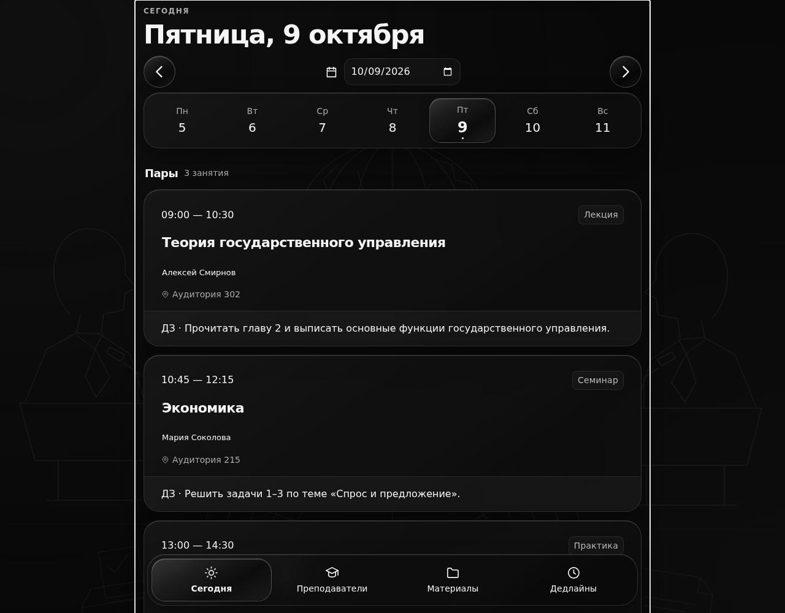

# Systemafgu Design

Готовый frontend-проект с дизайном **systemfgu / Midiary**: стеклянные карточки, фоновые иллюстрации факультетов, светлая и тёмная темы, адаптивная нижняя навигация.

Исходные стили и SVG перенесены из локального `systemfgu`. Пути к изображениям изменены на относительные; сведения об исходниках находятся в [docs/design-origin.json](docs/design-origin.json).



[Светлая тема](docs/preview-light.jpg) · [Мобильная версия](docs/preview-mobile.jpg)

## Запуск

Нужен Python 3. Запустите команды в папке проекта:

```sh
python3 -m http.server 5173 --bind 127.0.0.1
```

Откройте **http://localhost:5173**. Зависимости устанавливать не нужно.

Если установлен npm, та же команда доступна как `npm run dev`.

## Что работает

- Расписание: выбор дня и даты, переход к сегодняшнему дню, просмотр занятия.
- Редактирование демонстрационного домашнего задания.
- Преподаватели, материалы с фильтрами и скачиванием примерных конспектов.
- Дедлайны с отметкой выполнения.
- Переключение темы и оформления факультета.
- Сохранение темы, факультета, заданий и отметок в браузере.

Это самостоятельная демонстрация интерфейса. Учебные данные и имена вымышлены. Серверная авторизация, боты, реальные расписания и производственная база данных сюда не включены. При запрете localStorage интерфейс работает до закрытия страницы, а попытка сохранения показывает сообщение.

## Структура

```text
index.html                 — оболочка приложения
assets/css/                — исходные стили и адаптация демонстрации
assets/js/demo-data.js     — примерные учебные данные
assets/js/app.js           — навигация и взаимодействия
assets/img/                — SVG из исходного дизайна
assets/materials/          — примерные файлы для скачивания
docs/                      — происхождение дизайна и снимки интерфейса
scripts/check.py           — проверка JavaScript и ссылок на файлы
scripts/build.py           — сборка статической версии
.github/workflows/check.yml — проверка при push и pull request
```

## Проверка и сборка

Для проверки синтаксиса нужен Node.js 22 или новее; сам сайт Node.js не использует.

```sh
python3 scripts/check.py
python3 scripts/build.py
python3 -m http.server 5173 --bind 127.0.0.1 --directory dist
```

Для сборки достаточно Python 3. Папку `dist/` можно разместить на любом статическом хостинге. Все пути относительные, включая фоновые изображения: приложение работает в подпапке репозитория GitHub Pages.

Чтобы использовать Pages, настройте публикацию в параметрах репозитория или добавьте отдельный workflow деплоя. Текущий workflow проверяет и собирает проект.

## Изменение проекта

Учебные данные меняйте в `assets/js/demo-data.js`. Дополнительные стили пишите в `assets/css/demo.css`, который подключается последним. Замените Markdown-файлы в `assets/materials/` собственными материалами и обновите ссылки в данных.

Для подключения backend замените локальные данные и сохранение в `assets/js/app.js` на вызовы собственного API. Действующий `systemfgu` этим проектом не изменяется.

Секреты, `.env`, базы данных и пользовательские загрузки не входят в проект и исключены через `.gitignore`. В демонстрации используются CSS `backdrop-filter` и исходные поверхности; WebGPU SDK Liquid Glass не требуется.
